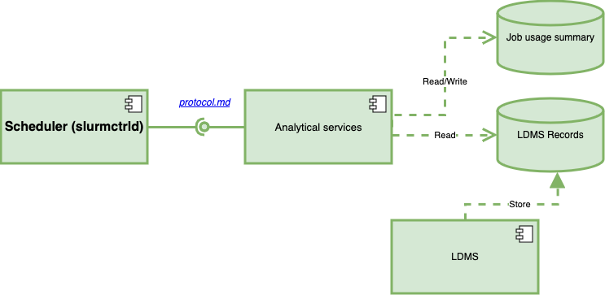
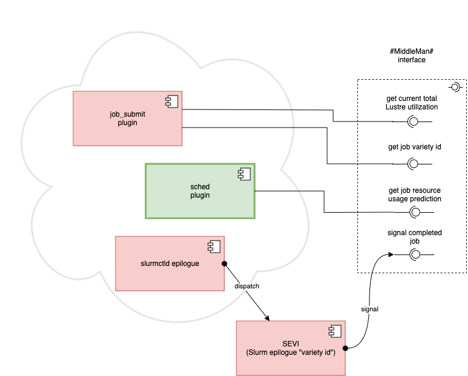

# A modified Slurm with scheduling plugins for Slurm-LDMS project


This repository contains source for the paper "Workload-Adaptive Scheduling for Efficient Use of Parallel File Systems in HPC Clusters" (presented at PBMS'2024). DOI: [10.1109/SCW63240.2024.00190](https://doi.org/10.1109/SCW63240.2024.00190)

> This fork is based on Slurm version 20.02.
> The original Slurm Readme file is [Slurm.README.rst](Slurm.README.rst).
> The installation procedure is the same as in the original documentation.


## Legal

This software is distributed with no warranty under the GNU General Public License, please see the files COPYING, DISCLAIMER, and LICENSE.OpenSSL for details.


## Overview of the whole system of the Slurm-LDMS project.



Other components of the system:
- An implementation of "simple" implementation of "analytical services" components:  
  https://github.com/algo74/py-sim-serv

- LDMS:  
  https://github.com/ovis-hpc/ldms

- SOS:  
  https://github.com/ovis-hpc/sos

- NumSOS:  
  https://github.com/nick-enoent/numsos

Example of a full system:  
https://github.com/algo74/vagrant-lustre-ldms-slurm/tree/lustre_2.12.4


## Main features of the Slurm modification

-	This modification of Slurm implements “workload-adaptive scheduling” or “I/O-aware scheduling”, based on the configuration.
-	Lustre resource is implemented using licenses, an existing feature of Slurm. 
    -	Scheduling with licenses was not fully implemented in the original Slurm: if a job needs more licenses than available, it could not get a reservation at the earliest time it can run but is simply ignored.
        -	Starting with version 22.05, Slurm implements licenses reservation for all jobs as an option.
    -	The scheduler plugin implements its own license tracker for the scheduling.
-	Modified node tracing (configurable).
    -	Slurm assigns and reserves specific node to jobs. This may create a situation that a job cannot be backfilled but could have been if Slurm assigned different nodes to previous jobs.
    -	Modified node tracing algorithm, roughly, records the total number of reserved nodes but postpones assignment of nodes to jobs (see _Alternative method of reserving nodes_ below).
-	The scheduling plugin gets predictions for the jobs (from "analytical services").
      - The predicted runtime does not affect job timelimit. The predictions don’t overwrite users provided licenses requirements (if user provided one) but are used as licenses requirements for jobs for which these requirements were not set. For more details see _Using predictions in the algorithm_ below.
    -	The predicted runtime and Lustre utilization are used in computing the workload-adaptive target.
    -	Predictions are “cached” (in a simple way).
      The cache is cleared before each scheduling round.
-	This modification of Slurm asks a remote server ("analytical services") for current utilization of Lustre licenses. It also keeps track of how many licenses were scheduled. The maximum value among these two is assumed to be “used” during the scheduling. 
-	The prototype uses a separated file to configure its options (helps with reconfiguration of the experiments).



## Configuration options

`sched/backfill` and the `job_submit/lustre_util` plugins are configured from a separate file. The name of the file is provided by the environmental variable `VINSNL_CONFIG`. The plugins reconfigure whenever they detect the configuration file is updated.

The configuration file is a JSON. An example of the configuration is presented below:
```json
{
  "server": {
    "name": "localhost",
    "port": 9999
  },
  "lustre_log_path": "/xch/logs/slurm/lustre_log.csv",
  "track_nodes": true,
  "backfill_type": null
}
```
The section `"server"` provides the parameters for connection to the analytical services. Port can be a string or a number. (`"server": null` disables the remote connection and, effectively, the workload-adaptive features). 

If `"lustre_log_path"` is provided, the scheduling plugin writes to the file some metrics regarding the scheduling of the “lustre” resource. 

`"track_nodes"` enables/disables the alternative method of reserving nodes (as described below).

`"backfill_type"` can take the following values (character case is ignored):
-	`"aware"` or `none` – implements I/O-aware logic only.
-	`"two_group"` – implements the workload-adaptive logic


## Alternative method of reserving nodes
When Slurm finds the earliest time for a job to run, it selects a particular set nodes for the job, even if the job could have run on another set of nodes. This set of nodes is reserved for the job. It may create a situation that another job cannot be backfilled but could have been if Slurm assigned different nodes to the previous jobs.
“Modified node tracing” records the total number of reserved nodes but postpones assignment of nodes to jobs. The Slurm’s internal node tracking system is used to confirm that jobs can run at selected intervals, but node in the Slurm tracking system are not reserved for jobs scheduled in the future.


## Configuring different scheduling strategies
### Baseline
-	Configure "analytical Services" to return zero estimates and zero current usage
-	Configure `"backfill_type"` to be `"Aware"`

### I/O Aware
-	Configure "Analytical Services" to return non-zero estimates and current usage
-	Configure `"backfill_type"` to be `"Aware"`

### Workload-adaptive
-	Configure "Analytical Services" to return non-zero estimates and current usage
-	Configure `"backfill_type"` to be `"Two-group"`


## Communication with “analytical services”
The communication is performed over a TCP connection. Slurm sends requests and receives responses. Both the requests and the responses are JSON structures (with no newlines) finished by a newline. The communication protocol is described in [`protocol.md`](src/plugins/sched/backfill/protocol.md).

 
## Using predictions in the algorithm

Because related results suggest that the use of predicted runtime for backfill may be counter-productive, the scheduling uses users’ timelimits for backfill. 
Both predicted runtime and predicted Lustre usage is utilized to compute the target throughput of the workload-adaptive scheduling and to classify jobs in the two-group approximation.
Job predicted Lustre usage is used at scheduling in case it is not specified by the user. If the user provide Lustre requirement for a job, the provided value is used at scheduling. This approach may offer better control of the job execution for experienced users. 
 

## Overview of Slurm core changes

### Stop default FCFS scheduler
Slurm has two schedulers. One scheduler is controlled by a plugin. One more scheduler is a simple FCFS scheduler that is invoked when a new job arrives. This scheduler cannot be disabled with the configuration file. The FCFS scheduler interferes with the workload-adaptive scheduler because the FCFS scheduler is not aware of any considerations outside of the Slurm standard scheduler. For these reasons, the prototype disables the FCFS scheduler. 

### Set an environmental variable containing “variety id” tag for slurmctld Epilog
For security reasons, Slurm sets up only environmental variables from a pre-defined list for slurmctrld epilogs’ environment. Therefore, if a plugin sets up another variable, it is not available to the epilogs. The prototype adds one variable (`LDMS_VARIETY_ID`) to the epilog environment.

### Modifications to licenses rules

The prototype modifies the core Slurm logic used to detect the system has enough licenses to run a job.
Because Slurm tries to handle licenses itself but not quite well, the handling of licenses reservations is disabled. 
> Later versions of Slurm improved reservation of licenses. It is still unclear how the core Slurm handling of licenses may interfere or be used in our scheduling plugin. 

The modifications make license list and mutex available to plugins.


## Configuration (`slurm.conf`)

An example can be found at https://github.com/algo74/vagrant-lustre-ldms-slurm/blob/master/xch/slurm/slurm.conf

### Important settings (that are needed for sure)

`Licenses=lustre:10000`
> This is the limit that the scheduler uses (integer); the units are arbitrary, they only need to be consistent with data from the remote service

##### SCHEDULING
`SchedulerType=sched/backfill`   
> The sched plugin name is the same but the plugin is modified

`SelectType=select/linear`    
> I tested it with this setting, but other (i.e. select/cray_aries) may work

###### PLUGINS
`JobSubmitPlugins=job_submit/lustre_util`

###### EPILOGUES
`EpilogSlurmctld=`...`/run_sevi.sh`  
> the script logs some info for debugging (which is not critical) and (importantly) runs `sevi`:
>	- a simple binary that
>	    - Reads “job id” and “classification tag” from environmental variables and 
>      - sends them to the remote server
>	(via TCP) 
>          - can be configured with envvar `VINSNL_SERVER`
>	- code is in https://github.com/algo74/slurm_epilog_variety_id

###### OPTIONAL
`Prolog=/xch/slurm/jobid_start.sh`  
`Epilog=/xch/slurm/jobid_stop.sh`
> these scripts were used to pass jobid to LDMS; this could be done differently
